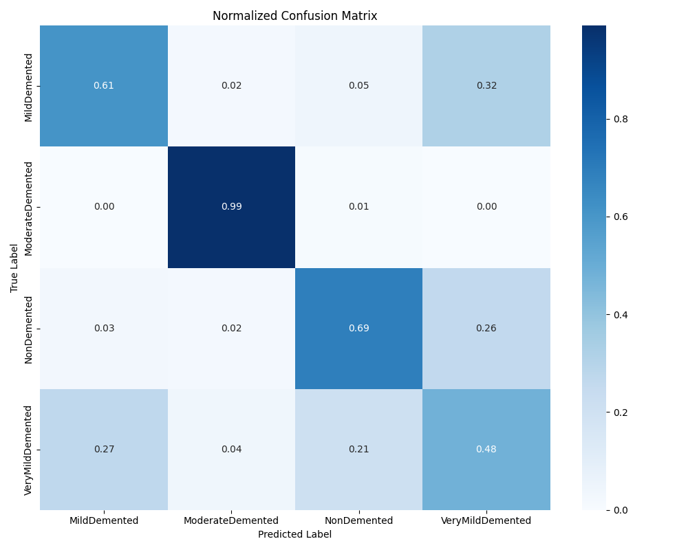
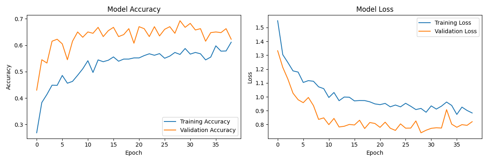

🧠 Alzheimer’s Disease Detection using MRI Scans

📌 Overview

Alzheimer’s Disease (AD) is a progressive neurodegenerative disorder that affects memory and cognitive abilities. Early detection plays a crucial role in effective treatment and patient care.

This project leverages MRI brain scans and a deep learning approach to detect Alzheimer’s stages. The model focuses on patterns associated with regions like the hippocampus, which are strongly correlated with AD progression.

---

🚀 Features

- Preprocessing of MRI scans (resizing, normalization, basic cleanup)
- Deep learning–based classification (TensorFlow/Keras; EfficientNetV2-based in this repo)
- Detects 4 stages: NonDemented, VeryMildDemented, MildDemented, ModerateDemented
- Model evaluation with accuracy, precision, recall, F1, ROC‑AUC, and confusion matrix
- Streamlit app for interactive inference and results history
- Research plot utilities for publications

---

🏗️ Tech Stack

- **Language**: Python
- **Libraries**:
  - TensorFlow / Keras – Model building and training
  - OpenCV – Image preprocessing
  - NumPy, Pandas – Data handling
  - scikit‑learn – Metrics, evaluation
  - Matplotlib, Seaborn – Visualization
  - Streamlit – Web UI for inference

---


📊 Dataset

This project expects a dataset organized by class folders under `combined_images/`:

```
combined_images/
├─ NonDemented/
├─ VeryMildDemented/
├─ MildDemented/
└─ ModerateDemented/
```

You can use publicly available MRI datasets such as the Alzheimer’s MRI datasets on Kaggle or ADNI.

- Dataset source example: [Kaggle – Alzheimer’s MRI Datasets](https://www.kaggle.com/datasets)

---


▶️ Usage

1) Preprocess and Load Data
- The training script internally uses `utils/data_preprocessing.py`. Ensure your dataset is placed under `combined_images/` as described above.

2) Train the Model
```bash
python train.py
```
- Saves final model to `models/final_model.h5`
- May create/update `models/best_model.h5` as a checkpoint
- Prints metrics and generates a confusion matrix image

3) Run the Web App (Optional)
```bash
streamlit run app.py
```
- Loads the trained model from `models/final_model.h5`
- Allows uploading an MRI image for inference
- Stores analysis history in `results/history.json`

4) Generate Research Plots (Optional)
```bash
python training_plots.py
# or
python run_training_plots.py
```
- Produces publication‑ready figures (e.g., training/validation curves)

---

 📈 Results

- Example outputs saved in the repo after running training/evaluation:
  - Confusion Matrix: `confusion_matrix.png`
  - Training History: `training_history.png`

If you have your own results images, you can include them below:





*(If images don’t appear on GitHub, ensure they exist in the repo and paths are correct.)*

---

🔮 Future Work

- Integrate Explainable AI (e.g., Grad‑CAM) for interpretability
- Optimize model for on‑device or edge deployment
- Add cross‑validation and more robust evaluation
- Expand dataset coverage and domain adaptation
